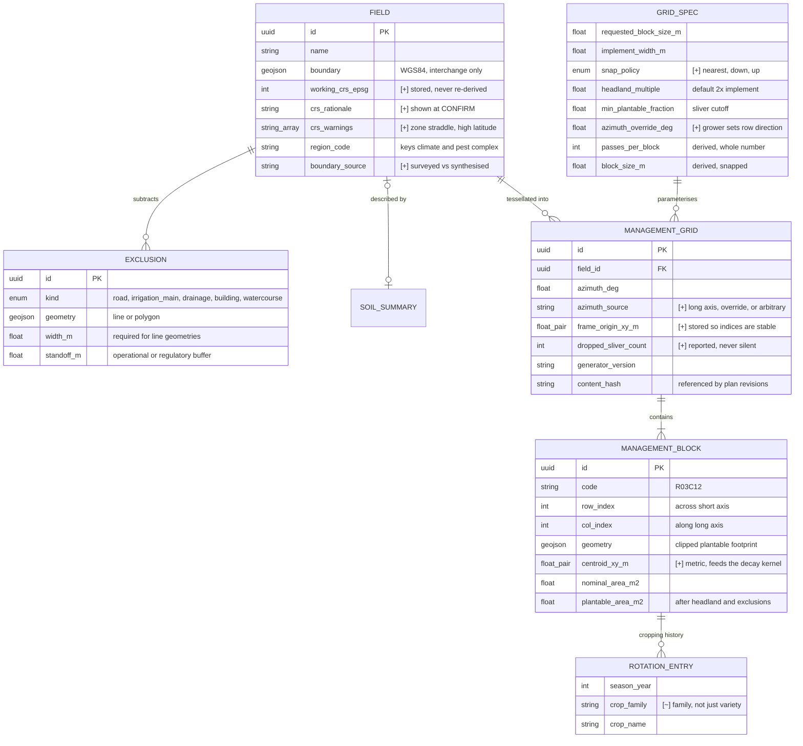
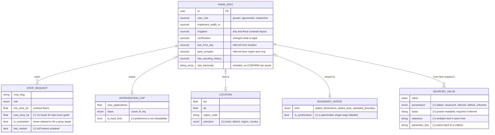
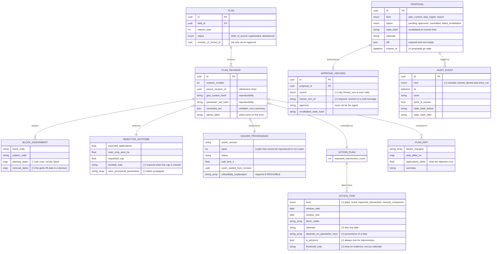

# Domain model — entity relationships

Split into four diagrams rather than one, because the four clusters have genuinely different
lifecycles: geometry is regenerated, agronomy is versioned and hashed, intake is mutated turn
by turn, and governance is append-only.

Entities marked **[+]** are additions to the brief's entity list; **[~]** are changes to what
it proposed. The reasoning for each is in [`phase0-checkpoint.md`](phase0-checkpoint.md).

---

## 1. Field and grid geometry

Adjacency and the block-to-block distance matrix are **derived, not stored**. At 400 blocks
the matrix is 1.3 MB and builds in milliseconds; materialising 160,000 pair rows to avoid
that would be a poor trade.

---

## 2. Agronomy and the parameter set

```mermaid
erDiagram
    PARAMETER_SET ||--o{ PARAMETER_RECORD : "contains"
    PARAMETER_SET ||--o{ INTERACTION_COEFFICIENT : "contains"
    PARAMETER_RECORD ||--o{ CITATION : "sourced by"
    PARAMETER_RECORD |o--|| VALIDITY_RANGE : "measured within"
    INTERACTION_COEFFICIENT ||--o{ CITATION : "sourced by"
    INTERACTION_COEFFICIENT |o--|| VALIDITY_RANGE : "measured within"
    INTERACTION_COEFFICIENT |o--|| DECAY_KERNEL : "falls off by"
    INTERACTION_COEFFICIENT |o--|| TEMPORAL_REQUIREMENT : "available when"

    CROP ||--o{ CROP_VARIETY : "has cultivars"
    CROP_VARIETY ||--o{ PLANTING_WINDOW : "per region"
    ROW_PATTERN_TEMPLATE ||--|{ PATTERN_COMPONENT : "composed of"
    PEST_SPECIES |o--|| DEGREE_DAY_MODEL : "phenology"
    DEGREE_DAY_MODEL ||--o{ PHENOLOGY_STAGE : "stages"
    PEST_SPECIES ||--o{ SCOUTING_OBSERVATION : "observed as"
    SCOUTING_OBSERVATION |o--o| UNTRUSTED_TEXT : "operator note"

    PARAMETER_SET {
        string version PK "semver, from filename"
        string description
        string content_hash "stored on every plan revision"
    }
    PARAMETER_RECORD {
        string key PK "pest.myzus_persicae.gdd.base_temp_c"
        value value
        string units
        enum status "published, provisional, deprecated"
        string provisional_rationale "required when provisional"
    }
    CITATION {
        enum kind "peer_reviewed, meta_analysis, extension, dataset, expert"
        string title
        string doi "one of doi or url required"
        string url
        string locator "[+] Table 3, so it is checkable"
    }
    VALIDITY_RANGE {
        string_array geographic_scope
        string_array cropping_system "open_field vs protected"
        map numeric_bounds "row_spacing_m, mean_temp_c"
    }
    INTERACTION_COEFFICIENT {
        string key PK
        string source_crop_slug "produces the effect"
        string target_crop_slug "receives it"
        string pest_slug "null only for crop-on-crop"
        enum mechanism "[+] repellency vs natural_enemy vs allelopathy"
        float effect_size
        enum effect_measure "[+] proportion, LRR, Hedges g, percent"
        float measured_at_distance_m "[+] the spacing actually tested"
    }
    DECAY_KERNEL {
        enum form "[+] exponential, threshold, linear_taper"
        float scale_m "exponential"
        float cutoff_m "stops a phantom tail summing"
        float radius_m "threshold"
    }
    TEMPORAL_REQUIREMENT {
        bool requires_co_occupancy "[+] the garlic lift-date case"
        int min_overlap_days "establishment lag"
        int effect_persists_after_removal_days
    }
    CROP {
        string slug PK
        string scientific_name
        string family "[~] drives the Solanaceae rotation rule"
        bool is_legume "allium allelopathy target"
    }
    CROP_VARIETY {
        string name
        float row_spacing_m
        float in_row_spacing_m
        float base_temp_c "crop base, NOT the pest's"
    }
    PLANTING_WINDOW {
        string region_code
        int earliest_doy
        int latest_doy "[~] may wrap the year end"
        bool requires_frost_free
    }
    ROW_PATTERN_TEMPLATE {
        string code PK "4:2_tomato_garlic"
        enum geometry "solid, bands, border, trap_perimeter, insectary"
        float border_depth_m
    }
    PATTERN_COMPONENT {
        string crop_slug
        enum role "[+] main, companion, trap, insectary, cover"
        int n_rows
        float row_spacing_m "[+] carries intra-block distance"
    }
    PEST_SPECIES {
        string slug PK
        enum kind "[+] insect vs fungal_pathogen: different drivers"
        enum guild "sap_sucking, fruit_borer, foliar_lesion"
        string_array host_families
        string economic_threshold "free text, keeps the sample unit"
        float adult_dispersal_range_m "[+] can a border even intercept it"
        string_array vectors_pathogens "[+] non-persistent transmission caveat"
    }
    DEGREE_DAY_MODEL {
        float base_temp_c
        float upper_threshold_c "[+] matters in a Punjab summer"
        string method "single_sine; must match the source"
    }
    PHENOLOGY_STAGE {
        string name
        float gdd_start "from the biofix, not 1 January"
        bool is_damaging
        bool is_treatable "[+] a borer inside a fruit is not"
    }
    SCOUTING_OBSERVATION {
        uuid id PK
        string block_code
        string grid_content_hash "[+] which grid the code refers to"
        date observed_on
        enum metric "count, incidence, severity, trap_catch"
        float value
        string sample_unit "a bare number is not an observation"
        enum trust "[+] grower, scout, sensor, imported_unverified"
    }
    UNTRUSTED_TEXT {
        string text "[+] fenced before reaching any prompt"
        string origin "file or endpoint"
    }
```

---

## 3. Intake

---

## 4. Plans and governance

Every gated action funnels through one function, `authorise_commit`, rather than a check per
call site — a second code path is how an approval gate eventually gets bypassed.
